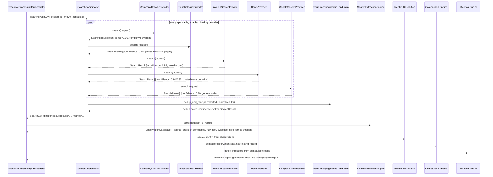

# Search Layer Federation: architecture redesign

**Status:** implemented. **Scope:** the Search Layer only — Identity
Resolution, the Comparison Engine, the Inflection Engine,
`ExecutiveProcessingOrchestrator`, the Cleaning Engine, and the
Verification Framework are all unmodified by this redesign.

## 1. Objective

The platform should continuously monitor executives and detect
professional inflection points — promotion, new job, company change, new
board appointment, retirement, resignation, new leadership role,
executive team update, an acquisition affecting an executive's role, a
new press announcement — from **multiple independent public sources**,
not a single provider's view of the world.

## 2. What changed: from single-primary-provider to federated

### 2.1 Previous architecture (single primary + fallback)

```
CompanyCrawlerProvider (primary, always runs)
        │
        ├── found results? ──► BrowserSearchProvider never runs (fallback_only)
        └── found nothing?  ──► BrowserSearchProvider runs as a fallback
        │
        ▼
SearchCoordinator (first-provider-wins semantics)
        │
        ▼
SearchExtractionEngine
```

One provider's website crawl decided, on its own, whether *any* other
source ever got consulted. A company website that had a "Leadership"
page but hadn't yet updated it after a real promotion would silently
starve every other source of the chance to catch that promotion
elsewhere (a press release, a LinkedIn update, a Reuters article).

### 2.2 Current architecture (federated)

```
┌──────────────────────┐  ┌──────────────────────┐  ┌──────────────────────┐  ┌──────────────────────┐  ┌──────────────────────┐
│ CompanyCrawlerProvider│  │ PressReleaseProvider │  │ LinkedInSearchProvider│  │    NewsProvider       │  │  GoogleSearchProvider │
│  company website /    │  │  company website /    │  │  Google index of      │  │  Reuters/Bloomberg/   │  │  general web search    │
│  leadership/board/... │  │  press/newsroom/...   │  │  linkedin.com          │  │  Yahoo Finance/       │  │                        │
│  confidence 1.00      │  │  confidence 0.95      │  │  confidence 0.98       │  │  BusinessWire/...     │  │  confidence 0.80       │
│                        │  │                        │  │                        │  │  confidence 0.94/0.92 │  │                        │
└───────────┬────────────┘  └───────────┬────────────┘  └───────────┬────────────┘  └───────────┬────────────┘  └───────────┬────────────┘
            │                            │                            │                            │                            │
            └────────────────────────────┴────────────────────────────┴────────────────────────────┴────────────────────────────┘
                                                              │
                                                              ▼
                                              SearchCoordinator.search()
                                    (runs every applicable/enabled/healthy provider,
                                     every request — no fallback_only in the default wiring)
                                                              │
                                                              ▼
                                        merge → deduplicate (same normalized URL,
                                            highest-confidence copy survives)
                                                              │
                                                              ▼
                                              rank by confidence, descending
                                          (application/search/result_merging.py)
                                                              │
                                                              ▼
                                                SearchCoordinationResult.results
                                                              │
                                                              ▼
                                             SearchExtractionEngine (unmodified)
                                    fetch each URL → extract facts (name/title/company/
                                    email/phone/linkedin_url/published_at/event_keywords)
                                                              │
                                                              ▼
                                            ObservationCandidate(s), each carrying
                                    source_provider / confidence / raw_text / evidence_type
                                                              │
                                                              ▼
                                    Identity Resolution → Comparison Engine → Inflection Engine
                                                       (all unmodified)
```

Every provider runs, every request. No provider's silence blocks another
provider's evidence from reaching extraction. The only thing that changes
per-request is *how much a given piece of evidence should be trusted*
(`confidence`), decided by a single, shared, documented, testable table
(`application/search/confidence.py`) — never by which provider happened
to run first.

## 3. Sequence diagram



## 4. Provider summary

| Provider | Discovers | Extraction stays via | Confidence source |
|---|---|---|---|
| `CompanyCrawlerProvider` | Leadership/management/board/about/team/people/press/news pages on the executive's own company site. | `SearchExtractionEngine` (unmodified). | `confidence.py` base `1.00`. |
| `PressReleaseProvider` | Press/newsroom/media/investor-relations/announcements pages on the same site. | `SearchExtractionEngine`. | `confidence.py` base `0.95`. |
| `LinkedInSearchProvider` | Google's index of the executive's public LinkedIn profile, restricted to `linkedin.com`. | `SearchExtractionEngine`. | `confidence.py` domain override `0.98`. |
| `NewsProvider` | Trusted business-news articles (Reuters, Bloomberg, Yahoo Finance, BusinessWire, PRNewswire, GlobeNewswire) mentioning the executive. | `SearchExtractionEngine`. | `confidence.py` domain overrides `0.94`/`0.92`. |
| `GoogleSearchProvider` | General web results combining name/company/title with inflection keywords (promotion, joined, appointed, named, board, CEO, VP, director). | `SearchExtractionEngine`. | `confidence.py` base `0.80`. |

None of the five providers do their own extraction — every one of them
implements `SearchProviderPort` and returns `SearchResult`s only
(title/url/snippet/source/rank/confidence). `SearchExtractionEngine`
(`infrastructure/search/extraction/`) is completely unmodified in its
pipeline shape; its fact vocabulary was widened once, in an earlier task,
to also recognize `email`/`phone`/`linkedin_url`/`published_at`, and again
in this redesign to recognize `event_keywords` (a deterministic scan for
inflection-signal words — see `fact_extraction.py`'s own docstring) and to
carry `source_provider`/`confidence`/`raw_text`/`evidence_type` onto every
`ObservationCandidate` it produces (see `enrichment_models.py`'s
`ObservationCandidate` docstring).

## 5. Deduplication and ranking algorithm

`application/search/result_merging.py`'s `dedup_and_rank`:

1. **Normalize** every result's URL (lowercase host, strip fragment and
   trailing slash — `https://Acme.com/press/` and
   `https://acme.com/press#top` are the same result).
2. **Deduplicate** by normalized URL: when two providers report the same
   URL, keep the **highest-confidence** copy (its `source`/`confidence`
   both survive — the surviving `SearchResult` always reflects the most
   trustworthy way that evidence was actually found).
3. **Rank** the survivors by `confidence` descending, with a deterministic
   tie-break (`source`, then `rank`) so identical inputs always produce
   identical output — no dependency on provider execution order or dict
   iteration order.

This runs once per `SearchCoordinator.search()` call, after every
provider has finished — no single provider can know whether another
provider already found the same URL, so the merge step could only ever
live at the coordinator level (see `coordinator.py`'s own module
docstring).

## 6. Confidence table

From `application/search/confidence.py` (the literal specification this
redesign was given):

| Source | Confidence |
|---|---|
| Company website (`company_crawler`) | `1.00` |
| LinkedIn (`linkedin.com`, any provider) | `0.98` |
| Official press release (`press_release`) | `0.95` |
| Reuters / Bloomberg (any provider) | `0.94` |
| BusinessWire / PRNewswire / GlobeNewswire / Yahoo Finance (any provider) | `0.92` |
| Google Search (`google_web_search`, unrecognized domain) | `0.80` |
| Unknown website / provider | `0.50` |

Domain-based overrides (LinkedIn, the news tiers) apply **regardless of
which provider surfaced the URL** — a Reuters article found via
`GoogleSearchProvider`'s general web search is scored identically to the
same article found via `NewsProvider`'s trusted-domain search, because
the *source* is what determines trust, not which provider's query
happened to surface it first.

## 7. Observation model extension

`ObservationCandidate` (`application/dto/enrichment_models.py`) gained
five optional, defaulted, backward-compatible fields: `source_provider`,
`published_date`, `confidence`, `raw_text`, `evidence_type` (`source_url`
already existed). Every existing call site — `CompanyWebsiteProvider`,
the Enrichment `GoogleSearchProvider`, every test fixture — keeps
compiling and behaving identically; `SearchExtractionEngine` is the one
place that now actually populates all five, inherited from the
`SearchResult` each candidate was extracted from (see `engine.py`'s
module docstring for the full reasoning).

`SearchResult` (`application/dto/search_models.py`) gained one field,
`confidence: float = 1.0`, for the same backward-compatible reason.

## 8. Why federated beats CompanyCrawler-first for inflection detection

1. **No single point of staleness.** A company website's own "Leadership"
   or "Press" page is frequently the *last* place a change appears — HR/
   comms processes lag real events by days or weeks. Under the previous
   architecture, if that page hadn't been updated yet, `BrowserSearchProvider`
   only ran as a fallback *when the crawl found zero pages at all* — a
   crawl that successfully found a (stale) leadership page never
   triggered the fallback, even though that stale page was actively
   hiding a real, already-public inflection event reported elsewhere.
   Federated search has no such gate: LinkedIn, a wire-service article, or
   a press release can each independently surface the same event the
   moment *they* go live, regardless of what the company's own site says.

2. **Corroboration, not just discovery.** Multiple independent sources
   agreeing on the same fact (a LinkedIn profile update *and* a Reuters
   article *and* the company's own press release, all naming the same new
   title) is itself a stronger signal than any one source alone — the
   downstream Comparison/Inflection Engines (unmodified) already reason
   over multiple `ObservationCandidate`s per attribute; federated search
   is what gives them more than one independent candidate to reason over
   in the first place. A single-primary-provider architecture structurally
   cannot produce that corroboration when the primary provider succeeds.

3. **Right source for the right event type.** Some inflection types are
   simply better-covered by some sources than others: board appointments
   and press-covered acquisitions are Newswire/press-release territory;
   quiet designation or location changes are LinkedIn territory; a
   company's own announcement of a new hire is the company website's
   territory. A single crawler, however good, cannot specialize in all of
   these simultaneously — five differently-scoped providers can.

4. **Confidence-aware downstream reasoning becomes possible.** The
   previous architecture had no notion of trust between sources at all —
   whatever the primary provider (or, rarely, the fallback) returned was
   the only evidence available, with no signal about how much to trust
   it. Federated search's `confidence` field, assigned by domain/provider
   and carried all the way onto each `ObservationCandidate`, gives every
   downstream stage (today: nothing consumes it yet, but the field exists
   and is populated) a foundation for confidence-weighted decisions later,
   without needing another redesign to add it.

5. **Resilience to any one source's outage or change.** If a company
   redesigns its website (breaking `CompanyCrawlerProvider`'s link
   scoring) or LinkedIn changes its markup, the previous architecture's
   single point of failure meant *no* search evidence for that executive
   until the primary provider was fixed (with, at best, a fallback that
   only activated on total silence). Federated search degrades
   gracefully: `SearchCoordinator`'s existing per-provider failure
   handling (a raising or failing provider never sinks the run — see
   `coordinator.py`) means the other four providers still contribute
   evidence even if one is broken.

## 9. What was explicitly not touched

Per this task's own constraints, none of the following were modified:
Identity Resolution Engine, Comparison Engine, Inflection Engine,
`ExecutiveProcessingOrchestrator`, Cleaning Engine, Verification
Framework. `SearchExtractionEngine`'s pipeline shape (page fetch → content
extraction → fact extraction → `ObservationCandidate`) is unchanged; only
its fact vocabulary and the metadata it populates were widened, in the
same additive, backward-compatible way the platform has extended it
before. `CompanyCrawlerProvider` itself (settings, link prioritization,
crawler, provider) was not modified at all — `PressReleaseProvider` is an
independent sibling, not a parameterization of it.

## 10. Testing

Every new/changed piece has dedicated unit tests, all using fakes/mocks
(no real network access, consistent with this platform's testing
philosophy throughout):

- `application/search/confidence.py` → `tests/unit/search/test_confidence.py`
- `application/search/result_merging.py` → `tests/unit/search/test_result_merging.py`
- `SearchCoordinator`'s merge/dedup/rank step → `tests/unit/search/test_coordinator.py`'s `TestMergeDedupAndRank`
- `infrastructure/search/google_custom_search/` → `tests/unit/google_custom_search/`
- `infrastructure/search/google/` → `tests/unit/google_web_search/`
- `infrastructure/search/linkedin/` → `tests/unit/linkedin_search/`
- `infrastructure/search/news/` → `tests/unit/news_search/`
- `infrastructure/search/press_release/` → `tests/unit/press_release/`
- `fact_extraction.py`'s `event_keywords` → `tests/unit/search_extraction/test_fact_extraction.py`'s `TestEventKeywords`
- `engine.py`'s new `ObservationCandidate` metadata → `tests/unit/search_extraction/test_engine.py`'s `TestFederatedSearchMetadata`

Run the full suite: `python -m pytest tests -q`.
